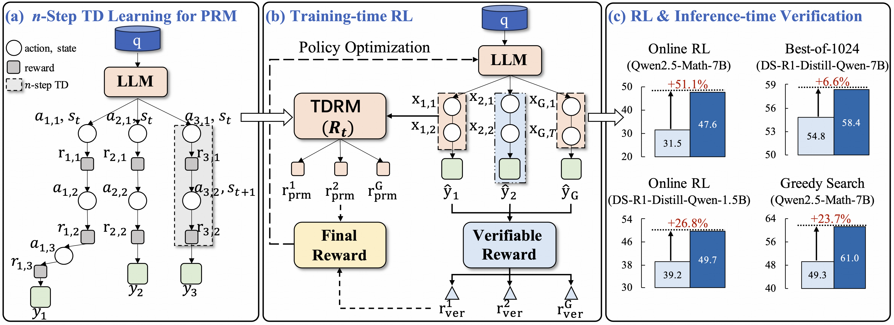
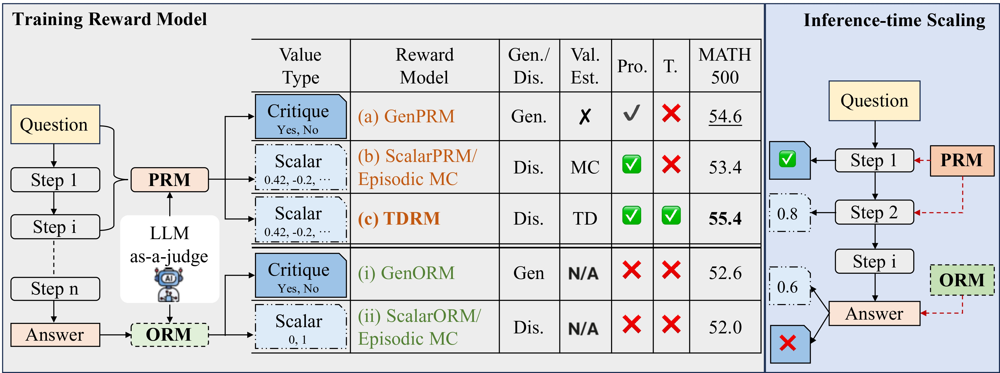
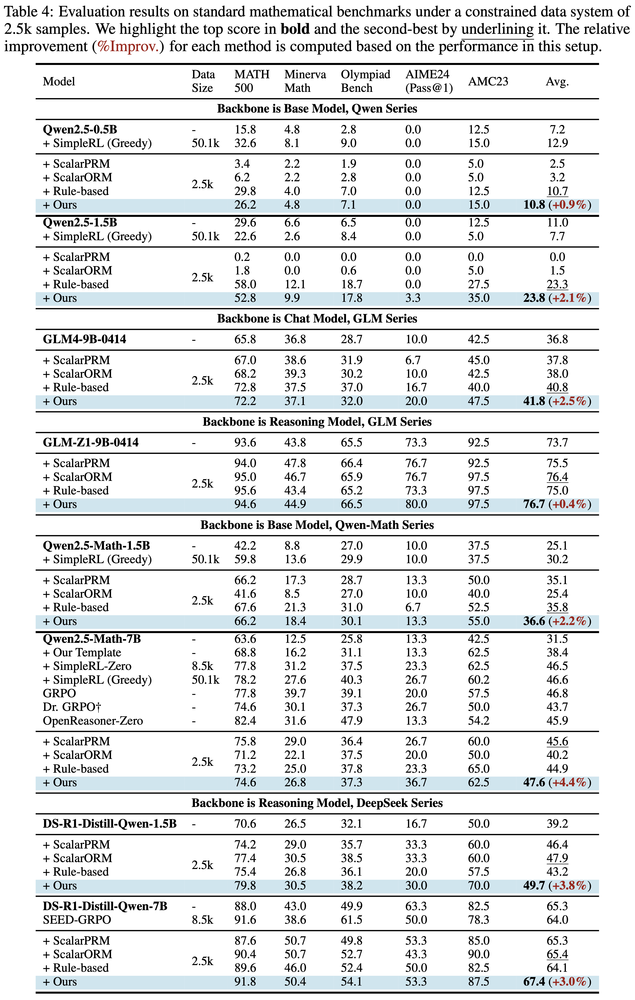
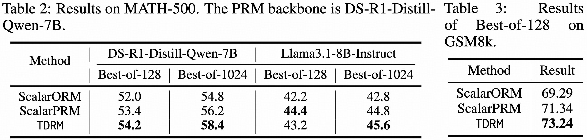
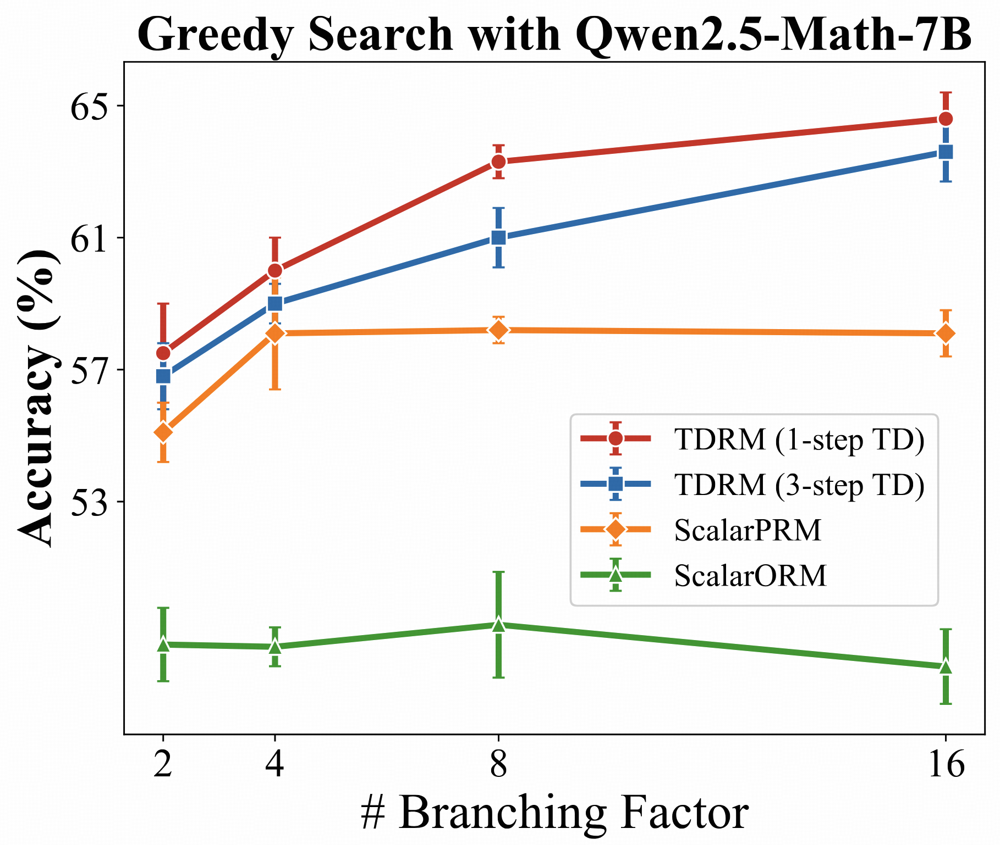
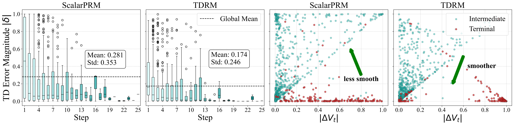

# TDRM: Smooth Reward Models with Temporal Difference for LLM RL and Inference

<p align="center">
📃 <a href="https://arxiv.org/abs/2509.15110" target="_blank">[TDRM]</a> 
<a href="https://github.com/THUDM/TDRM" target="_blank">[GitHub]</a>
<a href="https://llm-tdrm.github.io/" target="_blank">[Website]</a> <br>
</p>

This repository contains the code for paper "TDRM: Smooth Reward Models with Temporal Difference for LLM RL and Inference".

In this paper, we develop TDRM, a method for learning smoother and more reliable reward models by minimizing temporal differences during training. 
This temporal-difference (TD) regularization produces denser rewards and improves alignment with long-term objectives. 
Incorporating TDRM into the actor-critic style online RL loop yields consistent empirical gains.
Notably, TDRM is complementary to verifiable reward methods, and both can be used in tandem. 
Experiments show that TD-trained process reward models (PRMs) improve performance across Best-of-N (up to 6.6\%) and tree-search (up to 23.7\%) settings.
When combined with verifiable rewards, TDRM-trained PRMs lead to more data-efficient RL---achieving comparable performance with just 2.5k data to what baseline methods require 50.1k data to attain---and yield higher-quality language model policies on 8 model variants (5 series), e.g., Qwen2.5-(0.5B, 1,5B), GLM4-9B-0414, GLM-Z1-9B-0414, Qwen2.5-Math-(1.5B, 7B), and DeepSeek-R1-Distill-Qwen-(1.5B, 7B).



The codebase mainly consists of three parts:
1. Online PRM training using Temporal Difference with TDRM (data preprocessing + PRM training)
2. Applying a PRM to inference-time tree search
3. Applying a PRM to reinforcement learning

## Key Differences

Below, we compare reward models along several dimensions, including value type, value-estimation method, whether process rewards are used, and whether temporal-difference (TD) learning is applied. Our key distinction is that we train online with TD; the other models do not.


## Getting Started

### Environment Setup

Due to different dependency requirements, we use different environments for PRM training & eval and RL training. For PRM training & eval, it is recommended to use the following versions of the core packages:
```
transformers==4.45.0
deepspeed==0.16.4
```
You can install the requirements by: `pip install -r requirements_prm.txt`.
For RL training, it is recommended to use:
```
python>=3.12
vllm>=0.7.2
```
by installing with `pip install -r requirements_rl.txt`.
And you need to install trl from source:
```bash
cd trl
pip install -e .
```

### Models and Datasets

Datasets deployed on Hugging Face:

| Datasets      |
|---------------|
| 🤗 [zd21/TDRM-1-step-TD](https://huggingface.co/datasets/zd21/TDRM-1-step-TD)   |
| 🤗 [zd21/TDRM-2-step-TD](https://huggingface.co/datasets/zd21/TDRM-2-step-TD)   |
| 🤗 [zd21/TDRM-3-step-TD](https://huggingface.co/datasets/zd21/TDRM-3-step-TD) |

Policy Model trained with TDRM:

| Model Series       | Policy Model                      |
|--------------------|-----------------------------------|
| DS-R1-Distill-Qwen | 🤗 [zd21/DS-R1-Distill-Qwen-1.5B-TDRM](https://huggingface.co/zd21/DS-R1-Distill-Qwen-1.5B-TDRM) |
|                    | 🤗 [zd21/DS-R1-Distill-Qwen-7B-TDRM](https://huggingface.co/zd21/DS-R1-Distill-Qwen-7.5B-TDRM)   |
| Qwen2.5-Math       | 🤗 [zd21/Qwen2.5-Math-1.5B-TDRM](https://huggingface.co/zd21/Qwen2.5-Math-1.5B-TDRM)       |
|                    | 🤗 [zd21/Qwen2.5-Math-7B-TDRM](https://huggingface.co/zd21/Qwen2.5-Math-7B-TDRM)         |
| Qwen2.5            | 🤗 [zd21/Qwen2.5-0.5B-TDRM](https://huggingface.co/zd21/Qwen2.5-0.5B-TDRM)            |
|                    | 🤗 [zd21/Qwen2.5-1.5B-TDRM](https://huggingface.co/zd21/Qwen2.5-1.5B-TDRM)            |
| GLM4-9B-0414       | 🤗 [zd21/GLM4-9B-0414-TDRM](https://huggingface.co/zd21/GLM4-9B-0414-TDRM)            |
| GLM-Z1-9B-0414     | 🤗 [zd21/GLM-Z1-9B-0414-TDRM](https://huggingface.co/zd21/GLM-Z1-9B-0414-TDRM)          |

Reward Models including baselines:

| Reward Model            |
|-------------------------|
| 🤗 [zd21/DeepSeek-TD0-PRM](https://huggingface.co/zd21/DeepSeek-TD0-PRM)   |
| 🤗 [zd21/DeepSeek-TD2-PRM](https://huggingface.co/zd21/DeepSeek-TD2-PRM)   |
| 🤗 [zd21/DeepSeek-ScalarPRM](https://huggingface.co/zd21/DeepSeek-ScalarPRM) |
| 🤗 [zd21/DeepSeek-ScalarORM](https://huggingface.co/zd21/DeepSeek-ScalarORM) |

### Launching Experiments

All the tasks can be launched using scripts from `scripts`. Here is a table of commands:
| Task          | Command |
|---------------|---------|
| Training TDRM | `accelerate launch -m tdrm.tdrm_1_step_train --deepspeed ./configs/zero3.json` |
| RL Training | `CUDA_VISIBLE_DEVICES=0,1 bash qwen-2.5-0.5b-scripts/qwen25_grpo_process_rule_level3.sh`|
| Best-of-N Verification | `torchrun --nproc_per_node=4 --nnodes=1 --node_rank=0 --master_addr="localhost" --master_port=12345 prm_evaluation/src/rewarding/get_reward_math_prm_filter.py --data_path evaluation/outputs/math-500/mistral_rlhflow_bo128/ --save_path /path/to/scored_data/ --prm_path /path/to/checkpoint/`|
| Greedy Search Verification | `python -m scripts.tree_search.beam_search`|

For more details, please refer to the README files in `scripts/`


## Main Results

Here are the results of TDRM on RL training and Inference-time Scaling.

### RL Training


### Inference-time Scaling

For inference-time verification, we consider two settings: Best-of-N sampling and Greedy Search guided by reward models. Here are the results of both settings

#### Best-of-N Sampling



#### Greedy Search



## Analysis

To better understand reward models trained with TDRM, we conduct an analysis of smoothness over the RMs. First of all, inspired by the local Lipschitz Constant, we use the following formula to calculate the smoothness of RMs:

$$
L_{\text{smoothness}}
= \frac{1}{|\mathcal{D}|} \sum_{(s_t, s_{t+1}) \in \mathcal{D}}
\frac{\lvert V(s_{t+1}) - V(s_t) \rvert}{d(s_t, s_{t+1})}
$$

The smaller the metric, the smoother the reward model. It is shown that TDRM (0.2741) is indeed smoother than ScalarPRM (0.3331).

Furthermore, we display TD error across steps and TD error vs. value change magnitude.



## Citation
```
@misc{zhang2025tdrmsmoothrewardmodels,
      title={TDRM: Smooth Reward Models with Temporal Difference for LLM RL and Inference}, 
      author={Dan Zhang and Min Cai and Jonathan Li and Ziniu Hu and Yisong Yue and Yuxiao Dong and Jie Tang},
      year={2025},
      eprint={2509.15110},
      archivePrefix={arXiv},
      primaryClass={cs.LG},
      url={https://arxiv.org/abs/2509.15110}, 
}
```